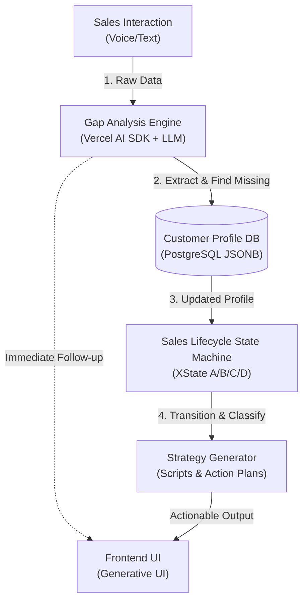

# OpenClaw Coding Agent - System Architecture

## 1. Core Data Pipeline (Strict Sequential Execution)
The system MUST execute in a strict sequential pipeline for every sales interaction.
1.  **Phase 1: Gap Analysis & Slot Filling (The Prerequisite):** All inputs (voice, text, notes) must FIRST go through the Gap Analysis Engine. It extracts entities based on the tenant's `profile_schema.json`. Output: An updated Customer Profile.
2.  **Phase 2: State Machine & Classification (The Decision):** The updated Customer Profile is THEN fed into the XState State Machine. Output: A/B/C/D classification update, effect analysis, and next-step strategy generation.

## 2. Architecture Diagram



## 3. Mandatory Directory Structure

You MUST place files strictly in the following Next.js (App Router) structure. Do NOT invent new root folders.

```text
├── app/
│   ├── api/            # API Routes (Vercel AI SDK endpoints, Webhooks)
│   ├── (dashboard)/    # Frontend UI (React Server Components, Generative UI)
├── lib/
│   ├── db/             # Database connection, ORM schema (Prisma/Drizzle), and queries
│   ├── ai/             # Vercel AI SDK core logic, Tool definitions, Prompts
│   ├── xstate/         # State machine definitions (Sales lifecycle A/B/C/D)
│   └── config/         # Tenant configuration loaders (profile_schema.json parser)
├── docs/               # Architecture, rules, and global context Markdown files
└── middleware.ts       # Global tenant routing and authentication

```

## 4. Data Flow Rules (Strict)

* **Rule A (No Bypassing State Machine):** Frontend components CANNOT update a customer's A/B/C/D status directly via an API. The API must send an EVENT to the `xstate` machine, and the machine dictates if the state transition is valid.
* **Rule B (Tenant Isolation):** Every database operation inside `lib/db/` MUST receive and use `tenant_id`.
* **Rule C (Generative UI Restriction):** Do not return heavy JSON blobs to the client if it's meant for UI. Stream React Server Components directly from the `lib/ai/` logic using Vercel AI SDK.

## 5. AI-Native UI/UX 空间架构规范（Canvas & Chat 主副驾模式）

### 5.1 空间划分标准（2:1 不对称网格布局）

桌面端页面必须采用 **2:1 不对称网格布局**，严格区分主画布与侧边栏：

- **左侧主画布 (Canvas, 2/3 宽度)**：
  - 承载**静态、收敛的企业级业务资产**
  - 包括但不限于：客户全景档案、画像完成度、AI 策略看板、数据可视化图表
  - 这是用户的"主驾驶舱"，展示结构化、持久化的业务数据
  - 使用 Tailwind CSS Grid：`xl:col-span-2`

- **右侧侧边栏 (Chat, 1/3 宽度)**：
  - 承载**动态、发散的时间流对话**
  - 包括但不限于：跟进记录输入、对话历史、实时反馈气泡
  - 这是用户的"副驾驶舱"，展示时间序列的交互流
  - 使用 Tailwind CSS Grid：`xl:col-span-1`

**布局代码示例**：
```tsx
<div className="grid grid-cols-1 xl:grid-cols-3 gap-6 max-w-7xl mx-auto">
  {/* 左侧主画布 (Canvas, 2/3) */}
  <div className="xl:col-span-2 space-y-6">
    {/* 客户全景档案 */}
    {/* 画像完成度 */}
    {/* AI 策略看板 */}
  </div>

  {/* 右侧侧边栏 (Chat, 1/3) */}
  <div className="xl:col-span-1 flex flex-col gap-6">
    {/* 跟进记录输入 */}
    {/* 对话历史 */}
  </div>
</div>
```

### 5.2 渲染隔离红线（复杂 UI 禁止右侧渲染）

**绝对禁止**在右侧聊天气泡内生成复杂的生成式 UI 组件！

- ❌ **禁止行为**：
  - 在右侧对话流中渲染长篇大论的 AI 策略建议（如 3000 字的销售话术）
  - 在右侧对话流中渲染复杂的数据表格、图表、卡片组件
  - 在右侧对话流中渲染需要用户交互的表单、按钮组

- ✅ **正确做法**：
  - 复杂的分析结果必须**定向挂载渲染到左侧的主画布区域**
  - 右侧仅保留**简短的状态反馈**（如"✅ 策略已生成，请查看左侧看板"）
  - 右侧对话气泡的内容应控制在 **200 字以内**

**渲染隔离示例**：
```tsx
// ❌ 错误：在右侧对话流中渲染复杂策略
<div className="chat-bubble">
  <StrategyCard strategy={longStrategy} /> {/* 3000 字的策略 */}
</div>

// ✅ 正确：在左侧主画布中渲染复杂策略
<div className="xl:col-span-2">
  <StrategyCard strategy={longStrategy} />
</div>
<div className="chat-bubble">
  ✅ 策略已生成，请查看左侧看板
</div>
```

### 5.3 心流设计原则（无限畅聊 + 按需生成）

- **无限畅聊**：即使画像完成度达到 80%，也不能硬性阻断用户的对话流。用户应该能够无限制地继续提问和补充信息。
- **按需生成**：当画像完成度达标时，通过**视觉提示**（如按钮高亮、呼吸灯动画）引导用户生成策略，而不是强制跳转。
- **空间左移**：所有复杂的生成式 UI（如 AI 策略看板）必须渲染在左侧主画布，保持右侧对话流的轻量和流畅。

### 5.4 实施检查清单

在实施 Canvas & Chat 模式时，必须确保：

- [ ] 桌面端使用 `grid grid-cols-1 xl:grid-cols-3` 布局
- [ ] 左侧主画布使用 `xl:col-span-2`，右侧侧边栏使用 `xl:col-span-1`
- [ ] 复杂的 AI 生成内容（策略、图表、卡片）渲染在左侧主画布
- [ ] 右侧对话气泡内容控制在 200 字以内
- [ ] 达到 80% 完成度时，不隐藏输入框，允许无限畅聊
- [ ] 达到 80% 完成度时，策略生成按钮出现视觉提示（如 `animate-pulse`）
- [ ] 后端不硬性阻断对话流，即使完成度达标也继续生成 AI 话术