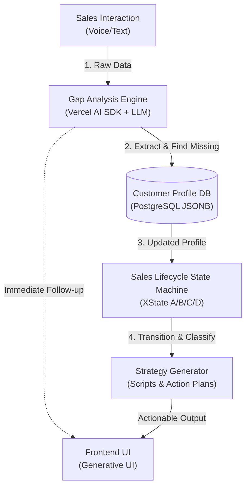

# OpenClaw Coding Agent - System Architecture

## 1. Core Data Pipeline (Strict Sequential Execution)
The system MUST execute in a strict sequential pipeline for every sales interaction.
1.  **Phase 1: Gap Analysis & Slot Filling (The Prerequisite):** All inputs (voice, text, notes) must FIRST go through the Gap Analysis Engine. It extracts entities based on the tenant's `profile_schema.json`. Output: An updated Customer Profile.
2.  **Phase 2: State Machine & Classification (The Decision):** The updated Customer Profile is THEN fed into the XState State Machine. Output: A/B/C/D classification update, effect analysis, and next-step strategy generation.

## 2. Architecture Diagram



## 3. Mandatory Directory Structure

You MUST place files strictly in the following Next.js (App Router) structure. Do NOT invent new root folders.

```text
├── app/
│   ├── api/            # API Routes (Vercel AI SDK endpoints, Webhooks)
│   ├── (dashboard)/    # Frontend UI (React Server Components, Generative UI)
├── lib/
│   ├── db/             # Database connection, ORM schema (Prisma/Drizzle), and queries
│   ├── ai/             # Vercel AI SDK core logic, Tool definitions, Prompts
│   ├── xstate/         # State machine definitions (Sales lifecycle A/B/C/D)
│   └── config/         # Tenant configuration loaders (profile_schema.json parser)
├── docs/               # Architecture, rules, and global context Markdown files
└── middleware.ts       # Global tenant routing and authentication

```

## 4. Data Flow Rules (Strict)

* **Rule A (No Bypassing State Machine):** Frontend components CANNOT update a customer's A/B/C/D status directly via an API. The API must send an EVENT to the `xstate` machine, and the machine dictates if the state transition is valid.
* **Rule B (Tenant Isolation):** Every database operation inside `lib/db/` MUST receive and use `tenant_id`.
* **Rule C (Generative UI Restriction):** Do not return heavy JSON blobs to the client if it's meant for UI. Stream React Server Components directly from the `lib/ai/` logic using Vercel AI SDK.